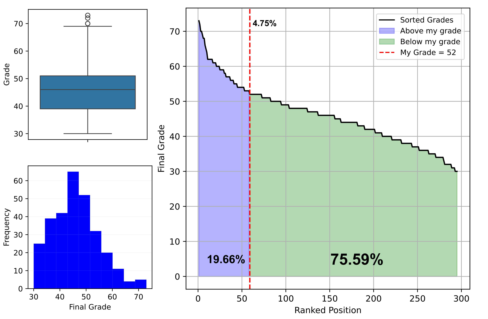

# Analysis of My Performance in the EMB. 2025 Civil Service Examination



## Overview

This repository documents the data cleaning, statistical analysis, and visualization of my personal performance in the EMB 2025 public service exam. It includes both individual-level and broader-group analysis.

## Repository Structure

```
.
├── 1-results_table.ipynb       # Parses and cleans raw result data from text
├── 2-data_analysis.ipynb       # Performs data analysis and visualization
├── data/
│   └── grades_broad_raw.txt    # Raw scores in plain text format
│   └── results_broad.csv       # Cleaned CSV with scores and results
├── results/
│   └── Final_figure.png        # Summary figure with distribution and my score
```

## Objective

- Parse the official raw exam results
- Identify my relative position among candidates
- Visualize score distributions and ranking
- Highlight my score with a reference line

## Results

- My final score placed me at position **52** among all candidates.
- I was able to identify that I ranked above approximately **75.60%** of  classified candidates.
- The visualization helped assess how competitive my performance was relative to others.

Statistics for Final Grade:
Mean: 46
Median: 46.0
Mode: 48
Minimum: 30.0
Maximum: 73.0

## Lessons Learned

- Parsing unstructured exam result data can be automated with Python.
- Visualizing performance helps contextualize preparation efforts.
- Such analyses can support strategic planning for future attempts.

